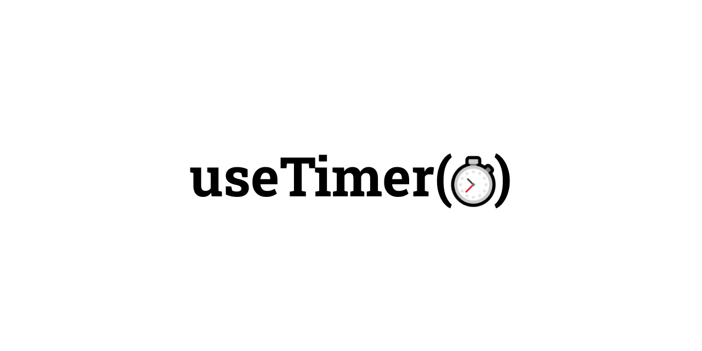

# ⏱ useTimer

[![version][version-badge]][npm]
[![downloads][downloads-badge]][npm]
[![size][size-badge]][bundlephobia]
[![github actions][github-actions-badge]][github-actions]
[![coverage][codecov-badge]][codecov]
[![typescript][typescript-badge]][typescript]
[![contributing][contributing-badge]][contributing]
[![contributors][contributors-badge]][contributors]
[![discord][discord-badge]][discord]

_[`React`][react] hook implementation of a stopwatch. Featured in [MURPHY][murphy]._

<p align="center">
    <a href="https://www.npmjs.com/package/@bradgarropy/use-timer">
        
    </a>
</p>

## 📦 Installation

This package is hosted on [`npm`][npm].

```bash
npm install @bradgarropy/use-timer
```

## 🥑 Usage

Import the `useTimer` hook in any React component, then call it to receive a `timer` that holds the state and functions which implement a stopwatch.

```javascript
import useTimer from "@bradgarropy/use-timer"

const App = () => {
    const timer = useTimer()

    timer.start()

    timer.lap()
    timer.lap()
    timer.lap()

    timer.stop()

    console.log(timer.elapsedTime)
    // 3000

    console.log(timer.laps)
    // [
    //   {start: 0, end: 1000, time: 1000},
    //   {start: 1000, end: 2000, time: 1000},
    //   {start: 2000, end: 3000, time: 1000}
    // ]

    timer.reset()
}
```

## 📖 API Reference

### `useTimer()`

Instantiates a `timer`, which updates with the latest values. No arguments are required. The hook returns an object with everything needed to implement a stopwatch.

| Name          |    Type    |  Example   | Description                                                    |
| :------------ | :--------: | :--------: | :------------------------------------------------------------- |
| `isActive`    | `boolean`  |  `false`   | Indicates that the timer is active, either running or paused.  |
| `isInactive`  | `boolean`  |   `true`   | Indicates that the timer is inactive, and hasn't been started. |
| `isRunning`   | `boolean`  |  `false`   | Indicates if the timer is running.                             |
| `isPaused`    | `boolean`  |  `false`   | Indicates if the timer is paused.                              |
| `elapsedTime` |  `number`  |    `0`     | Total time in milliseconds.                                    |
| `laps`        |  `object`  |    `[]`    | Array of [`laps`][laps].                                       |
| `start`       | `function` | `function` | Starts the timer.                                              |
| `stop`        | `function` | `function` | Pauses the timer.                                              |
| `reset`       | `function` | `function` | Resets the timer.                                              |
| `lap`         | `function` | `function` | Adds a new lap.                                                |

Each of the functions are ignored in certain situations.

-   `start` does nothing if the timer is already running.
-   `stop` does nothing if the timer is already paused.
-   `reset` does nothing if the timer is inactive.
-   `lap` does nothing if the timer is paused.

## ❔ Questions

🐛 report bugs by filing [issues][issues]  
📢 provide feedback with [issues][issues] or on [twitter][twitter]  
🙋🏼‍♂️ use my [ama][ama] or [twitter][twitter] to ask any other questions

## ✨ contributors

<!-- ALL-CONTRIBUTORS-LIST:START - Do not remove or modify this section -->
<!-- prettier-ignore-start -->
<!-- markdownlint-disable -->
<table>
  <tr>
    <td align="center"><a href="https://bradgarropy.com"><br /><sub><b>Brad Garropy</b></sub></a><br /><a href="https://github.com/bradgarropy/use-timer/commits?author=bradgarropy" title="Code">💻</a> <a href="https://github.com/bradgarropy/use-timer/commits?author=bradgarropy" title="Documentation">📖</a> <a href="https://github.com/bradgarropy/use-timer/commits?author=bradgarropy" title="Tests">⚠️</a> <a href="#infra-bradgarropy" title="Infrastructure (Hosting, Build-Tools, etc)">🚇</a></td>
  </tr>
</table>

<!-- markdownlint-restore -->
<!-- prettier-ignore-end -->

<!-- ALL-CONTRIBUTORS-LIST:END -->

[codecov]: https://app.codecov.io/gh/bradgarropy/use-timer
[contributing]: https://github.com/bradgarropy/use-timer/blob/master/contributing.md
[contributors]: #-contributors
[npm]: https://www.npmjs.com/package/@bradgarropy/use-timer
[codecov-badge]: https://img.shields.io/codecov/c/github/bradgarropy/use-timer?style=flat-square
[version-badge]: https://img.shields.io/npm/v/@bradgarropy/use-timer.svg?style=flat-square
[downloads-badge]: https://img.shields.io/npm/dt/@bradgarropy/use-timer?style=flat-square
[contributing-badge]: https://img.shields.io/badge/PRs-welcome-success?style=flat-square
[contributors-badge]: https://img.shields.io/github/all-contributors/bradgarropy/use-timer?style=flat-square
[issues]: https://github.com/bradgarropy/use-timer/issues
[twitter]: https://twitter.com/bradgarropy
[ama]: https://bradgarropy.com/ama
[bundlephobia]: https://bundlephobia.com/result?p=@bradgarropy/use-timer
[size-badge]: https://img.shields.io/bundlephobia/minzip/@bradgarropy/use-timer?style=flat-square
[github-actions]: https://github.com/bradgarropy/use-timer/actions
[github-actions-badge]: https://img.shields.io/github/workflow/status/bradgarropy/use-timer/%F0%9F%9A%80%20release?style=flat-square
[typescript]: https://www.typescriptlang.org/dt/search?search=%40bradgarropy%2Fuse-timer
[typescript-badge]: https://img.shields.io/npm/types/@bradgarropy/use-timer?style=flat-square
[discord]: https://bradgarropy.com/discord
[discord-badge]: https://img.shields.io/discord/748196643140010015?style=flat-square
[react]: https://reactjs.org
[murphy]: https://murphy.bradgarropy.com
[laps]: https://github.com/bradgarropy/use-timer/blob/master/src/useTimer.tsx#L16
